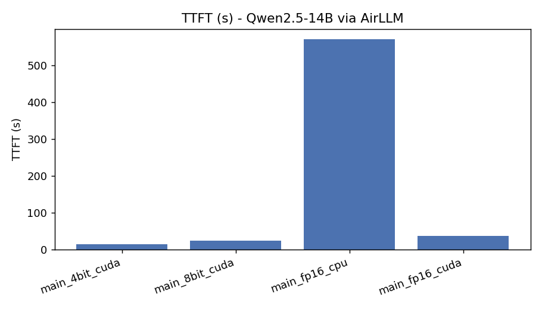
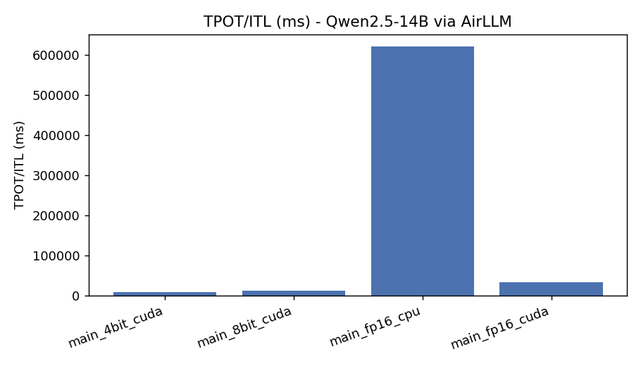
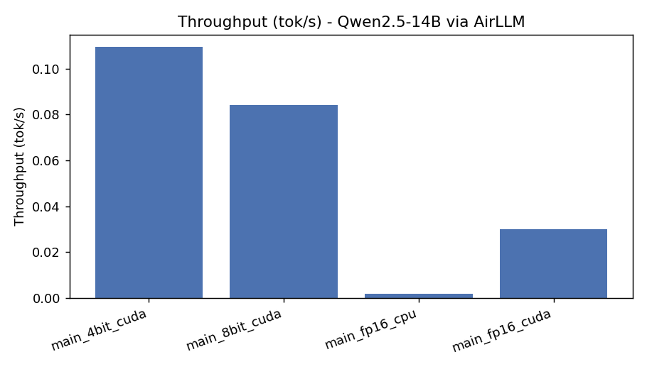
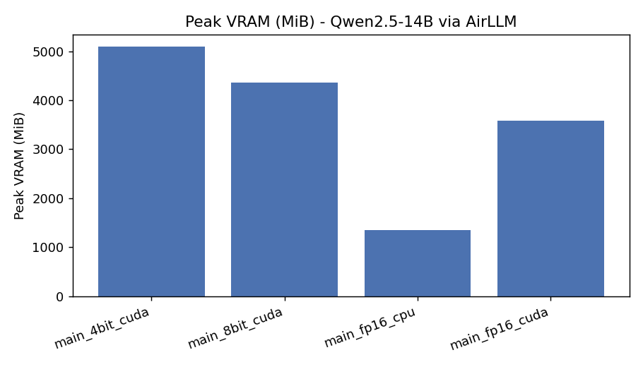
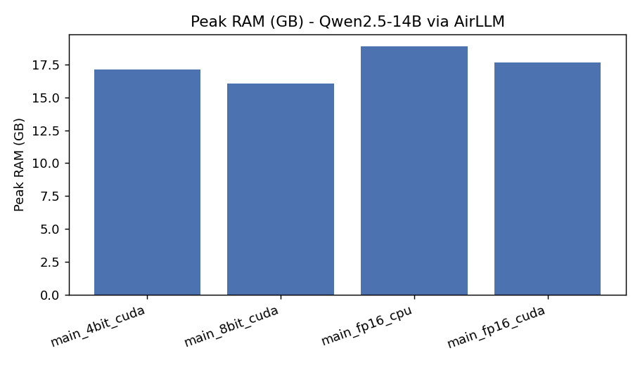
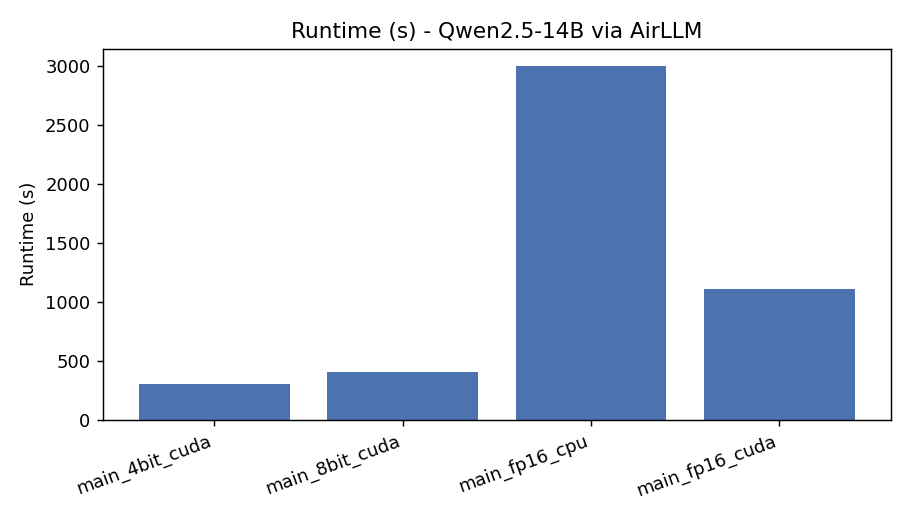
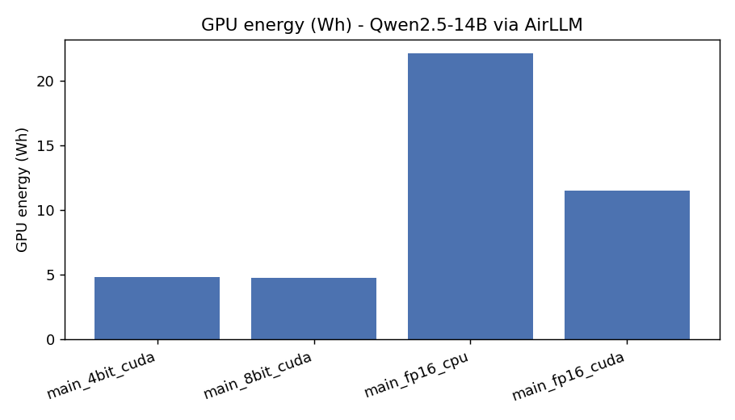
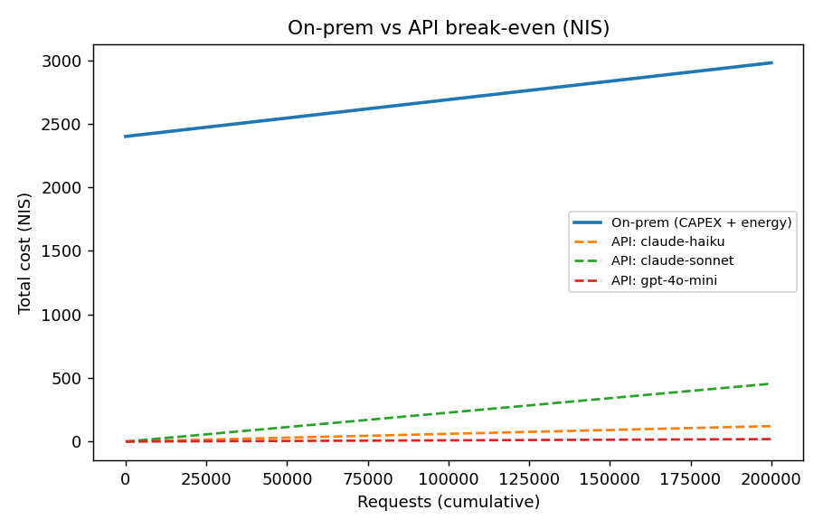
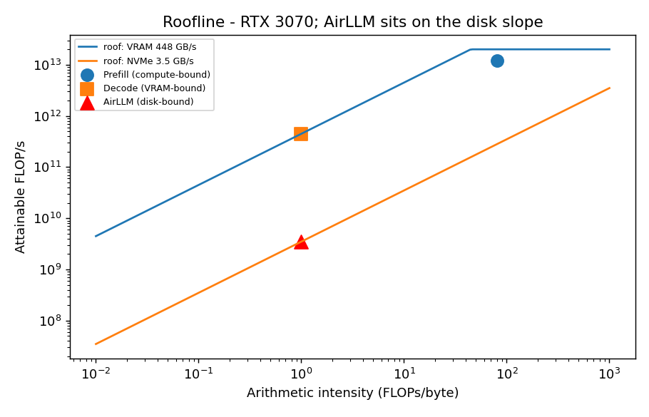

# EX05 — Running a Massive LLM Locally: AirLLM, Quantization & Performance Benchmarking

> **Deep-dive technical report.** Running **Qwen2.5-14B-Instruct** (FP16 ≈ 29 GB — far too
> big for the GPU) on an **i9-9900K / 32 GB RAM / RTX 3070 (8 GB) / WD SN570 NVMe** box, by
> streaming it one layer at a time with **AirLLM**, comparing **FP16 / 8-bit / 4-bit**
> quantization, and analyzing the result both technically and economically (on-prem vs API).

This README **is** the report. See [`docs/PRD.md`](docs/PRD.md), [`docs/PLAN.md`](docs/PLAN.md),
[`docs/TODO.md`](docs/TODO.md), [`docs/PROMPTS.md`](docs/PROMPTS.md),
[`docs/PRD_airllm_pipeline.md`](docs/PRD_airllm_pipeline.md).

---

## 0. Assignment mapping (submission checklist)

Every EX05 requirement and where it is answered in this submission:

| EX05 section | Where to find it |
|---|---|
| **§5.1** Hardware documentation + model choice & justification | [§1](#1-hardware--model-justification) + [`docs/PRD.md`](docs/PRD.md) + Evidence [§11.1](#111-hardware-confirmation) |
| **§5.2** Direct baseline run (expected to fail / crawl) | [§4](#4-results) (B0) + [`results/baseline_b0.json`](results/baseline_b0.json) + Evidence [§11.2](#112-baseline-cuda-oom) |
| **§5.3** AirLLM + quantization (FP16/8-bit/4-bit) | [§3](#3-experiment), [§4](#4-results) + `src/orch5/services/benchmark.py`, `model_prep.py` |
| **§5.4** Measurement & comparison (TTFT, ITL/TPOT, throughput, RAM/VRAM, runtime, power, quality) | [§4](#4-results) tables + charts + [`results/comparison.md`](results/comparison.md), [`results/`](results/) JSON |
| **§5.5** Cost analysis: On-Prem vs API (+ Cloud GPU) + break-even | [§6](#6-cost-analysis--on-prem-vs-api-vs-cloud-gpu-) + `src/orch5/services/cost.py` + [`results/cost_summary.json`](results/cost_summary.json) + `figures/breakeven.png` |
| **§5.6** Analysis of inference concepts (Prefill/Decode, VRAM, memory/compute-bound, virtual memory/paging) | [§5](#5-analysis--why-the-numbers-look-like-this-concept-linkage), esp. [§5.6 subsection](#56-inference-concepts--courselecture-connection-assignment-56) |
| **§5.7** Original extension (≥1) | [§7](#7-original-extension--quantization-quality-sweep--roofline-assignment-57) + `figures/roofline.png` |
| **§7** Deliverables (repo, report, code, tables, graphs, cost, reproduce) | [§10 Deliverables](#10-deliverables-assignment-7) + whole repo |
| README requirements (§8) | this file (hardware, experiment, findings, cost, concept-linkage, reproduce, embedded tables/graphs/evidence) |

## 1. Hardware & model justification

| Component | Spec | Role in the experiment |
|---|---|---|
| GPU | RTX 3070, **8 GB** (confirmed `nvidia-smi`; WMI's 4 GB is a known bug) | the 8 GB wall the direct run hits |
| CPU | i9-9900K, 8C/16T | CPU comparison run; prefill matmuls |
| RAM | 32 GB | caps the FP16 working set |
| Storage | WD Blue SN570 **1 TB NVMe** (~3.5 GB/s) | **the real AirLLM bottleneck** — weights stream from here every token |

**Why Qwen2.5-14B-Instruct:** FP16 ≈ 29 GB cannot fit 8 GB VRAM (so a direct run is *expected
to* fail with CUDA OOM — confirmed in §4), it stresses 32 GB RAM, finishes in the time budget,
and Qwen is AirLLM-`AutoModel` friendly. (32B would blow the time budget; 8B fits in 32 GB RAM,
weakening the story.)

## 2. Environment & the "don't use the newest libraries" lesson

AirLLM 2.11 broke against every current release; the project is pinned to a coherent
2024-era stack (single source of truth: [`pyproject.toml`](pyproject.toml) + `uv.lock`):

| Library | "latest" (broke) | pinned | failure |
|---|---|---|---|
| torch | 2.6.0 | **2.4.1+cu124** | streamed weights stranded on `meta` device |
| transformers | 5.x / 4.46 | **4.44.2** | ≥4.45 refactored Qwen2's forward |
| optimum | 2.2 | **1.23.3** | 2.x removed `bettertransformer` (airllm import) |
| tokenizers / hub | 0.20 / 1.x | **0.19.1 / 0.24.7** | newer `tokenizer.json` format |
| numpy / datasets | 2.4 / 5.0 | **1.26.4 / 2.21.0** | pyarrow/numpy2 access-violation segfault |

Three AirLLM model quirks were also handled in `src/orch5/services/model_prep.py` (needs a
multi-shard `index.json`; single-file models must be re-saved as one file so no layer spans a
shard boundary; small Qwen models need untied embeddings for an explicit `lm_head`).

## 3. Experiment

Engine matrix (see `docs/PLAN.md` §2): **B0** direct `transformers.to('cuda')` (baseline,
expected OOM) · **A1/A2/A3** AirLLM FP16/8-bit/4-bit on GPU · **C1** AirLLM FP16 on CPU.
Fixed prompt (a 45-token "explain page faults"), 32 new tokens (4 for the slow CPU run).
Metrics captured per run: TTFT, TPOT/ITL, throughput, peak RAM, peak VRAM, runtime, GPU
energy (NVML), plus the generated text. Reproduce: see §8.

## 4. Results

**Baseline B0 (direct load):** ❌ `CUDA out of memory` — *"Tried to allocate … GPU 0 has a
total capacity of 8.00 GiB of which 0 bytes is free … 22.46 GiB is allocated by PyTorch."*
The model tried to put **22.46 GB on an 8 GB GPU**. This is the bottleneck (RQ1): **VRAM**.

**AirLLM sweep (GPU), Qwen2.5-14B, 32 output tokens:**

| Config | TTFT (s) | TPOT/ITL (s/tok) | Throughput (tok/s) | Peak VRAM (MiB) | Peak RAM (GB) | Runtime (min) | Energy (Wh) | Avg GPU power (W) |
|---|---|---|---|---|---|---|---|---|
| A1 FP16 | 36.9 | 33.4 | 0.030 | 3 581 | 17.7 | 18.6 | 11.5 | 37 |
| A2 8-bit | 23.6 | 11.5 | 0.084 | 4 353 | 16.0 | 6.8 | 4.7 | 42 |
| A3 4-bit | 14.8 | 9.0 | 0.109 | 5 091 | 17.1 | 6.1 | 4.8 | 57 |
| C1 FP16 **(CPU)** | 570.7 | 620.0 | 0.0016 | — | 18.9 | 50.0* | — | — |

\* C1 generated only **4 tokens** (14B on CPU is ~18× slower than GPU); per-token metrics
(TTFT/TPOT) are still comparable. CPU TPOT **620 s/token** vs GPU FP16 **33 s/token** — the CPU
is bottlenecked on *both* disk streaming **and** slow CPU matmuls, while the GPU only waits on
disk. This is the assignment's CPU-vs-GPU comparison.

Per-metric charts (all generated by `scripts/make_figures.py` from `results/*.json`),
one per line so they render cleanly on GitHub:

**TTFT — Time To First Token (s)**



**TPOT / ITL — per-token latency (ms)**



**Throughput (tokens/sec)**



**Peak VRAM (MiB)**



**Peak RAM (GB)**



**Total runtime (s)**



**GPU energy (Wh)**



Average GPU power is reported in the results table above (37 → 42 → 57 W for FP16 → 8-bit → 4-bit).

Full machine-readable table: [`results/comparison.md`](results/comparison.md); raw per-run JSON
in [`results/`](results/).

**Output quality** stayed coherent at every quant level (all correctly explain a page fault),
so the accuracy "red line" (RQ3) is **not reached at 4-bit** for these prompts.

## 5. Analysis — why the numbers look like this (concept linkage)

- **Peak VRAM is 3.5–5 GB, never near 8 GB** → AirLLM holds only ~one layer + KV-cache on the
  GPU at a time. That is exactly why a model whose weights are 29 GB *runs at all* on 8 GB.
- **The bottleneck moved from VRAM-bandwidth to DISK-bandwidth.** Normal decode is
  memory-bound (re-reads weights from VRAM each token); AirLLM re-reads **all weights from the
  NVMe** each token. So TPOT is seconds, not milliseconds — the price of "infinite VRAM."
  This is the OS **virtual-memory / paging** analogy: SafeTensors flat buffer → `mmap` → page
  faults pull the needed layer from disk, then evict it.
- **Quantization helps by shrinking the per-token disk read.** FP16 streams ~28 GB/token
  (33.4 s); 4-bit streams ~3.8 GB/token (9.0 s). Not perfectly proportional — per-layer Python
  overhead and 4/8-bit dequantization add a floor — but the direction is unambiguous.
- **GPU avg power is only 37–57 W** (TDP 220 W) → the GPU idles waiting on disk. Concrete proof
  the system is **I/O-bound, not compute-bound** (Roofline: far left on the disk slope, not the
  compute roof). Prefill (TTFT) is the compute-heavy GEMM phase; Decode (TPOT) is the
  memory/disk-movement phase — here both are disk-dominated.
- **Peak VRAM rises with more quantization** (3 581 → 5 091 MiB) — bitsandbytes keeps
  dequantization workspace on the GPU, a small counter-intuitive cost of compression.

### Research questions
- **RQ1 (bottleneck):** VRAM — the 8 GB GPU vs a 22.46 GB load; identified by the baseline OOM.
- **RQ2 (AirLLM):** Layer-by-layer mmap streaming; reallocates so peak VRAM ≈ 1 layer + KV
  (3.5–5 GB). Same idea as OS paging — disk as backing store.
- **RQ3 (quantization):** ↓ footprint, ↓ TTFT/TPOT, ↑ throughput, quality preserved at 4-bit
  for these prompts (red line not hit).
- **RQ4 (Prefill/Decode):** TTFT ↔ prefill (+KV build); TPOT/ITL ↔ decode. Both disk-bound here.
- **RQ5 (price of local):** GPU 0.03–0.11 tok/s (9–33 s/token); **CPU 0.0016 tok/s
  (620 s/token)**. Usable for offline/batch, never interactive — the cost of running an
  otherwise-impossible model is latency.
- **RQ6 (on-prem vs API):** **API is cheaper at every volume here** (see §6) — AirLLM's
  inefficiency makes on-prem worthwhile only for privacy/data-control, not cost.

### 5.6 Inference concepts & course/lecture connection (assignment §5.6)

Mapping the **measured** numbers to the L08 lecture concepts (lecture terms in **bold**):

- **Prefill vs Decode.** Inference has two phases. **Prefill** ingests the whole 45-token
  prompt in one parallel **GEMM** (matrix×matrix) pass and builds the **KV-cache**, emitting
  the *first* token → measured as **TTFT**. **Decode** then emits one token at a time, each a
  **GEMV** (vector×matrix) pass that re-reads all weights → measured as **TPOT / ITL**.
- **Compute-bound vs memory-bound vs disk/I-O-bound.** Classically Prefill is **compute-bound**
  (limited by **FLOPs / Tensor Cores**) and Decode is **memory-bound** (limited by VRAM
  bandwidth). Here AirLLM streams every layer from the SSD, so the true limiter drops *below*
  VRAM bandwidth to **disk bandwidth** — the system is **I/O-bound**. Evidence: avg GPU power
  is only **37–57 W** of a 220 W board (the GPU starves waiting for data), and TPOT is in
  **seconds**, consistent with NVMe ~3.5 GB/s, not VRAM's ~448 GB/s (which would give ms).
- **VRAM role & why 8 GB is limiting.** Weights + activations + KV-cache must sit in **VRAM**.
  FP16-14B weights are ~29 GB; the direct baseline tried to place **22.46 GB on 8 GB → CUDA
  OOM**. AirLLM keeps only **one layer + KV-cache** resident → peak VRAM **3.5–5 GB < 8 GB**,
  which is precisely why the model runs at all.
- **RAM role.** 32 GB system **RAM** is the staging tier: `mmap`'d shards + the OS **page
  cache** + per-layer host buffers live here (measured peak **16–19 GB**). If the working set
  exceeded RAM the OS would **swap** to disk (the lecture's swap-thrash warning) — it didn't.
- **Virtual memory / paging / offloading.** AirLLM is **user-space virtual memory for model
  weights**: a **SafeTensors flat byte buffer** → **`mmap`** → touching a layer triggers a
  **page fault** that loads it from NVMe, then it is evicted. This is the OS **paging** idea
  ("pretend you have ~1 TB of RAM") applied to **offloading** weights to disk.
- **AirLLM layer-by-layer mechanism.** Build the model skeleton on the `meta` device (no
  weights), then per layer: mmap-load shard → move to device → forward → free → next. Working
  set = 1 layer.
- **Why TTFT ≠ TPOT.** Both require streaming the *entire* model from disk, so both are
  seconds. TTFT also processes the full prompt (prefill GEMM + KV build) and pays first-touch
  (cold) costs, so it is a bit larger (fp16: TTFT 36.9 s vs TPOT 33.4 s — each ≈ one full
  model stream).
- **Why quantization improves throughput & latency.** The bottleneck is *bytes streamed from
  disk per token*. FP16 ≈ 28 GB/token → 33 s; 4-bit ≈ 3.8 GB/token → 9 s. Fewer bytes →
  lower TTFT/TPOT, higher throughput (0.030 → 0.109 tok/s).
- **Why CPU is much slower.** The CPU run (fp16, 620 s/token) is bottlenecked on **both** disk
  streaming **and** slow CPU matmuls (no Tensor Cores, far fewer FLOPs); the GPU only waits on
  disk. Hence ~18× slower than the GPU at the same precision.
- **How the Roofline supports the conclusion.** On the **Roofline** (§7) the RTX 3070's compute
  roof (~20 TFLOPS) and VRAM-bandwidth slope sit far above AirLLM's operating point, which
  lands on the **NVMe-disk slope** — a visual confirmation that the bottleneck is disk I/O, not
  compute, matching the idle-GPU power evidence.

## 6. Cost analysis — on-prem vs API vs Cloud GPU (₪)

Computed in `src/orch5/services/cost.py` from [`config/cost_config.json`](config/cost_config.json);
summary in [`results/cost_summary.json`](results/cost_summary.json). **All assumptions, stated
explicitly so the analysis is transparent and reproducible:**

- **Workload / token assumptions:** one request = the measured 4-bit GPU run = **45 input + 32
  output tokens**, consuming **4.82 Wh** of GPU energy (from `results/main_4bit_cuda.json`).
- **Electricity:** **₪0.60 / kWh** (Israel residential incl. VAT). FX: **₪3.70 / USD**.
- **API pricing** (published USD per 1M tokens, input / output): **GPT-4o-mini** 0.15 / 0.60 ·
  **Claude Haiku** 0.80 / 4.00 · **Claude Sonnet** 3.00 / 15.00.
- **Prompt/Context Caching:** cached static-prefix input tokens billed at **0.10×** (≈10×
  cheaper) — makes the API option *even* cheaper for repetitive prompts.
- **On-prem hardware (CAPEX):** marginal GPU **₪1 800** + maintenance **₪200/yr** over a
  **3-year** life ⇒ **₪2 400** fixed; **OPEX** = measured energy × tariff.
- **Cloud GPU (optional 3rd line):** **$0.40 / GPU-hour** rental, billed by runtime.

**Per-request cost (NIS), based on the 4-bit GPU run (45 in / 32 out tokens, 4.82 Wh):**

| Option | NIS / request |
|---|---|
| On-prem **energy only** (OPEX) | **0.00290** |
| API — GPT-4o-mini | 0.000096 |
| API — Claude Haiku | 0.00061 |
| API — Claude Sonnet | 0.00228 |

**Break-even: never.** On-prem's *energy alone* (₪0.0029/req) already exceeds every API's
per-request price — before adding the ₪2 400 CAPEX. So `on-prem = 2400 + 0.0029·N` stays above
`API = price·N` for all N (break-even volume = ∞). See `figures/breakeven.png`:



**Why:** AirLLM trades efficiency for the *ability to run at all* — long runtimes burn more
energy per request than an API charges. Prompt/Context Caching only widens the gap (cached
input tokens bill ~10× cheaper). **Recommendation:** for this 14B-on-8 GB scenario, use an
**API** for cost/latency; choose **on-prem** only when **data privacy / no-egress** is
mandatory (the lecture's core on-prem argument). A Cloud-GPU rental that *fits* the model would
beat both on throughput but also keeps data off-box.

## 7. Original extension — quantization-quality sweep + Roofline (assignment §5.7)

The assignment lists **examples** of possible extensions — LoRA/QLoRA fine-tuning, or a
comparison across **different model sizes**. **This submission deliberately chose a different
extension:** a **quantization performance/quality sweep + a Roofline/bottleneck graph + extra
energy/power metrics.** (LoRA/QLoRA and the model-size comparison were *not* done — they remain
as the suggested alternatives.)

The chosen extension, concretely:
1. **Quantization sweep — FP16 vs 8-bit vs 4-bit** (§4): one extra axis beyond a single run,
   measuring how each level moves footprint, TTFT, TPOT, throughput, VRAM and energy, plus a
   qualitative output check (all levels stay coherent ⇒ no accuracy "red line" hit at 4-bit).
2. **Extra energy/power metrics** (GPU Wh + avg W via NVML) — not in the required metric list;
   they directly expose the idle-GPU / I/O-bound behavior and feed the cost analysis.
3. **Roofline / bottleneck graph** — places Prefill (compute roof), Decode (VRAM-bandwidth
   slope) and **AirLLM (NVMe-disk slope)** on the RTX 3070's roofs, visually proving the system
   is disk-I/O-bound (matching the 37–57 W idle-GPU evidence).



### Future work (not performed in this submission)
The following are **possible future extensions only — they were not carried out here**, because
the chosen original extension (the quantization sweep + Roofline + energy/power analysis above)
is already a complete, self-contained extension:
- **Page-cache warm-up measurement** — quantify cold-vs-warm OS page-cache effects on TTFT/TPOT
  across repeated runs.
- **Shard-location I/O sensitivity** — compare NVMe vs SATA vs an external drive for
  `layer_shards_saving_path` to isolate disk bandwidth's effect on per-token latency.
- **Comparison across different model sizes** — e.g. 0.5B / 3B / 14B on the same hardware.
- **LoRA / QLoRA fine-tuning.**

These are listed for completeness as next steps, not as work done in this submission.

## 8. Reproduce
```powershell
uv sync                                   # creates .venv from pyproject + uv.lock
uv run python -m orch5.main env           # verify CUDA + versions
uv run python scripts/prepare_models.py   # download + split 14B (resumable)
uv run python scripts/run_benchmarks.py   # baseline + AirLLM sweep (resumable)
uv run python scripts/make_figures.py     # tables + figures
uv run pytest --cov=src                    # tests (>=85%)
```
Set secrets via `.env` (copy `.env-example`); never commit it. HF token optional for Qwen2.5.

## 9. Tests & quality gates
- **uv** is the only package manager (`pyproject.toml` + `uv.lock`); run everything via `uv run`.
- **ruff**: `uv run ruff check src tests scripts` → 0 errors.
- **pytest**: 29 unit + 1 integration (tiny-model AirLLM) tests; **coverage 90% (gate ≥85%)**:
  `uv run pytest --cov=src`. Config-driven (no hardcoded values); files ≤150 LOC; SDK→services→shared layering.

## 10. Deliverables (assignment §7)
Everything the assignment's §7 asks for is in this repo:

- ✅ **Full experiment + measurement code** — `src/orch5/` (SDK/services/shared) + `scripts/`
- ✅ **Deep-dive technical report** — this `README.md`
- ✅ **Planning docs** — `docs/PRD.md`, `PLAN.md`, `TODO.md`, `PROMPTS.md`, `PRD_airllm_pipeline.md`
- ✅ **Benchmark result tables** — §4 + [`results/comparison.md`](results/comparison.md) + per-run JSON in [`results/`](results/)
- ✅ **Graphs** — `figures/` (TTFT, TPOT, throughput, VRAM, RAM, runtime, energy, break-even, roofline), all embedded above
- ✅ **Cost analysis + break-even + explicit assumptions** — §6 + `cost.py` + `results/cost_summary.json`
- ✅ **Results ↔ inference-concept analysis** — §5 + §5.6
- ✅ **Original extension** — §7
- ✅ **Evidence / logs / transcripts** — §11 (+ `logs/` on disk, git-ignored)
- ✅ **Reproduce instructions** — §8
- ✅ **Tests + quality checks** — §9 + `tests/`
- 🔒 **Excluded from git** (by `.gitignore`): model weights, HF cache, AirLLM shards, `.venv*`, `.env`/tokens

## 11. Evidence

**Verbatim terminal-transcript evidence** (copied from real terminal output and saved
`results/`/`logs/` files — **not screenshots**, and nothing fabricated). No screenshot PNGs are
included because this was run headlessly (WSL → native-Windows via interop), so there is no GUI
to capture; every block below is reproducible via the §8/§9 commands.

### 11.1 Hardware confirmation
Preflight on the target PC + `uv run python -m orch5.main env`:
```
GPU  : NVIDIA GeForce RTX 3070 — VRAM 8192 MiB / 8 GB (nvidia-smi; Windows WMI's 4 GB is a known bug)
CPU  : Intel Core i9-9900K, 8 cores / 16 threads ; RAM 32 GB
Disk : WDS100T3X0C (WD Blue SN570, 1 TB NVMe) ; ~193 GB free at start
env  : Python 3.12.10 (Windows-11) | torch 2.4.1+cu124 | transformers 4.44.2 | airllm installed
       cuda_available: True | NVIDIA GeForce RTX 3070 | 8.0 GiB | cc 8.6 | cuda 12.4
```

### 11.2 Baseline CUDA OOM
From [`results/baseline_b0.json`](results/baseline_b0.json) (direct `transformers` load on the 8 GB GPU):
```
status: failed_as_expected   error_type: OutOfMemoryError
CUDA out of memory. Tried to allocate 136.00 MiB. GPU 0 has a total capacity of 8.00 GiB
of which 0 bytes is free. Of the allocated memory 22.46 GiB is allocated by PyTorch ...
```

### 11.3 AirLLM generation example
From [`results/main_4bit_cuda.json`](results/main_4bit_cuda.json) (14B, 4-bit, GPU) — coherent output:
```
prompt: "Explain what an operating system page fault is and why it matters for performance."
output (truncated): "An operating system (OS) page fault occurs in the context of virtual
memory management. It happens when a program or process running on a co..."
```

### 11.4 uv environment verification
```
$ uv run python -m orch5.main env
orch5 1.00 | torch 2.4.1+cu124 | cuda True
```

### 11.5 ruff clean
```
$ uv run ruff check src tests scripts
All checks passed!
```

### 11.6 Tests & coverage (≥85%)
```
$ uv run pytest --cov=src -q
TOTAL                                341     34    90%
Required test coverage of 85.0% reached. Total coverage: 90.03%
30 passed, 14 warnings in 19.18s
```

### 11.7 Local chat demo
A short **functionality check (not a benchmark)** — one normal user question answered by the
local model on the already-prepared **Qwen2.5-14B 4-bit AirLLM shards (RTX 3070, GPU)**. Saved
to [`results/demo_chat.json`](results/demo_chat.json) and
[`logs/demo_chat_transcript.md`](logs/demo_chat_transcript.md).

**Command:**
```
$ uv run python scripts/demo_chat.py
```
**Prompt:** *"What is a large language model? Answer in one simple sentence."*

**Real model answer** (28 tokens, ~237 s; cut off at `max_new_tokens=28`):
> A large language model is an artificial intelligence model that processes and generates
> human-like text based on the input it receives, trained on vast amounts of …

This is a single short generation to confirm the local LLM answers a normal question — it is
**not** a performance measurement (see §4 for the actual benchmarks).
